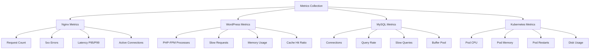

# Syfe-Assignment

## Overview

This repository provides a production-ready WordPress deployment on Kubernetes with enterprise-grade features including:

- High Availability with horizontal pod autoscaling
- Custom OpenResty/Nginx with Lua support for advanced routing and security
- Optimized MySQL configuration for WordPress workloads
- Comprehensive Monitoring with Prometheus and Grafana
- Advanced Alerting for proactive issue detection
- ReadWriteMany Storage for seamless scaling

### Why This Solution?

| Feature | This Solution | Basic Deployment |
|---------|--------------|------------------|
| Scalability |  HPA with 3-10 replicas |  Single instance |
| Monitoring |  50+ metrics tracked |  Basic health checks |
| Performance |  OpenResty + Lua |  Standard Nginx |
| Alerts |  15+ alert rules |  None |
| Storage |  RWX for scaling |  RWO limitations |
| Security |  Built-in rate limiting |  Basic |

---

## Features

### Core Features

-  Auto-Scaling: Horizontal Pod Autoscaler based on CPU/Memory
-  Monitoring: Real-time metrics with Prometheus & Grafana
-  Alerting: 15+ pre-configured alert rules
-  Security: Lua-based rate limiting and security headers
-  Persistent Storage: ReadWriteMany volumes for scaling
-  Optimized: Performance-tuned for high traffic

### Technical Stack

```
┌─────────────────────────────────────────────────────────┐
│                   Load Balancer Service                  │
└────────────────────┬────────────────────────────────────┘
                     │
        ┌────────────┴────────────┐
        │                         │
┌───────▼────────┐       ┌───────▼────────┐
│  Nginx Pod 1   │       │  Nginx Pod N   │
│  ┌──────────┐  │       │  ┌──────────┐  │
│  │OpenResty │  │       │  │OpenResty │  │
│  │  + Lua   │  │       │  │  + Lua   │  │
│  └────┬─────┘  │       │  └────┬─────┘  │
│       │        │       │       │        │
│  ┌────▼─────┐  │       │  ┌────▼─────┐  │
│  │WordPress │  │       │  │WordPress │  │
│  │ PHP-FPM  │  │       │  │ PHP-FPM  │  │
│  └────┬─────┘  │       │  └────┬─────┘  │
└───────┼────────┘       └───────┼────────┘
        │                        │
        └────────────┬───────────┘
                     │
             ┌───────▼────────┐
             │ MySQL StatefulSet│
             │  ┌───────────┐  │
             │  │  MySQL    │  │
             │  │   8.0     │  │
             │  └───────────┘  │
             └─────────────────┘
```


## Prerequisites

### Required Tools

| Tool | Version | Purpose |
|------|---------|---------|
| Kubernetes | 1.24+ | Container orchestration |
| Helm | 3.0+ | Package manager |
| kubectl | 1.24+ | Kubernetes CLI |
| Docker | 20.10+ | Container runtime |

### Kubernetes Requirements

- CPU: Minimum 4 cores available
- Memory: Minimum 8GB available
- Storage: ReadWriteMany (RWX) storage class (NFS, CephFS, etc.)
- LoadBalancer: Cloud provider LB or MetalLB

### Quick Check

```bash
kubectl version --short

# check availavle storage classes
kubectl get storageclass

# cluster resources
kubectl top nodes
```

---

## Quick Start

### Clone Repository

```bash
git clone https://github.com/yourusername/wordpress-k8s-production.git
cd wordpress-k8s-production
```

### Build Images

```bash
cd docker/nginx && docker build -t your-registry/openresty:latest .
cd docker/wordpress && docker build -t your-registry/wordpress:latest .
cd docker/mysql && docker build -t your-registry/mysql:latest .
```

### Configure Values

```bash
cp helm/wordpress/values.example.yaml helm/wordpress/values.yaml

vim helm/wordpress/values.yaml
```

### Deploy

```bash
# install WordPress
helm install my-wordpress ./helm/wordpress \
  --namespace wordpress \
  --create-namespace \
  -f helm/wordpress/values.yaml

# Install monitoring
helm install prometheus prometheus-community/kube-prometheus-stack \
  --namespace monitoring \
  --create-namespace \
  -f monitoring/prometheus-values.yaml
```

### Verify

```bash
kubectl get pods -n wordpress
kubectl get pods -n monitoring

# Get WordPress URL
kubectl get svc -n wordpress my-wordpress

# access Grafana
kubectl port-forward -n monitoring svc/prometheus-grafana 3000:80
```

---

## Detailed Installation

### Step 1: Prepare Docker Images

#### OpenResty/Nginx with Lua

```bash
cd docker/nginx
```

Dockerfile Features:
-  OpenResty 1.21.4.1
-  Lua support with custom modules
-  Custom configure options
-  Prometheus metrics endpoint
-  Health check endpoint

```bash
docker build -t your-registry/openresty:latest .
docker push your-registry/openresty:latest
```

#### WordPress PHP-FPM

```bash
cd docker/wordpress
```

Includes:
-  PHP 8.2-FPM
-  All WordPress extensions
-  OPcache optimization
-  Redis support
-  WP-CLI pre-installed

```bash
docker build -t your-registry/wordpress:latest .
docker push your-registry/wordpress:latest
```

#### MySQL

```bash
cd docker/mysql
```

Optimizations:
-  InnoDB tuning
-  Query cache enabled
-  Slow query logging
-  WordPress-specific settings

```bash
docker build -t your-registry/mysql:8.0 .
docker push your-registry/mysql:8.0
```

### Step 2: Setup Storage

#### NFS Provisioner

```bash
helm repo add nfs-subdir-external-provisioner \
  https://kubernetes-sigs.github.io/nfs-subdir-external-provisioner/

helm install nfs-provisioner nfs-subdir-external-provisioner/nfs-subdir-external-provisioner \
  --set nfs.server=YOUR_NFS_SERVER \
  --set nfs.path=/exported/path \
  --set storageClass.name=nfs-client
```

### Step 3: Configure Helm Values

Edit `helm/wordpress/values.yaml`:

```yaml
# image
image:
  nginx:
    repository: your-registry/openresty
    tag: latest
  wordpress:
    repository: your-registry/wordpress
    tag: latest
  mysql:
    repository: your-registry/mysql
    tag: "8.0"

# scaling
replicaCount: 3

autoscaling:
  enabled: true
  minReplicas: 3
  maxReplicas: 10
  targetCPUUtilizationPercentage: 70

# storage
persistence:
  enabled: true
  storageClass: "nfs-client" 
  wordpress:
    size: 20Gi
  mysql:
    size: 50Gi

# database
mysql:
  rootPassword: "CHANGE_ME_ROOT_PASSWORD"
  database: "wordpress"
  user: "wordpress"
  password: "CHANGE_ME_WP_PASSWORD"
```

 Security Note: Use Kubernetes secrets for production:

```bash
kubectl create secret generic wordpress-secrets \
  --from-literal=mysql-root-password='YOUR_STRONG_PASSWORD' \
  --from-literal=mysql-password='YOUR_STRONG_PASSWORD' \
  -n wordpress
```

### Step 4: Deploy WordPress

```bash
kubectl create namespace wordpress

helm install my-wordpress ./helm/wordpress \
  --namespace wordpress \
  --set mysql.rootPassword="$(openssl rand -base64 32)" \
  --set mysql.password="$(openssl rand -base64 32)" \
  --set wordpress.config.authKey="$(openssl rand -base64 64)" \
  --set wordpress.config.secureAuthKey="$(openssl rand -base64 64)" \
  --set wordpress.config.loggedInKey="$(openssl rand -base64 64)" \
  --set wordpress.config.nonceKey="$(openssl rand -base64 64)"

kubectl get pods -n wordpress -w
```

Expected Output:

```
NAME                            READY   STATUS    RESTARTS   AGE
my-wordpress-5d7c9f8b6d-7xk2m   3/3     Running   0          2m
my-wordpress-5d7c9f8b6d-9nqp4   3/3     Running   0          2m
my-wordpress-5d7c9f8b6d-hxm8w   3/3     Running   0          2m
my-wordpress-mysql-0            2/2     Running   0          2m
```

### Step 5: Deploy Monitoring Stack

```bash
helm repo add prometheus-community \
  https://prometheus-community.github.io/helm-charts
helm repo update

helm install prometheus prometheus-community/kube-prometheus-stack \
  --namespace monitoring \
  --create-namespace \
  -f monitoring/prometheus-values.yaml

kubectl apply -f monitoring/prometheus-rules.yaml -n monitoring

kubectl get pods -n monitoring -w
```

### Step 6: Import Grafana Dashboards

```bash

kubectl get secret -n monitoring prometheus-grafana \
  -o jsonpath="{.data.admin-password}" | base64 -d
echo


kubectl port-forward -n monitoring svc/prometheus-grafana 3000:80

```

---

##  Configuration

### Environment Variables

```yaml
WORDPRESS_DB_HOST: mysql-service
WORDPRESS_DB_NAME: wordpress
WORDPRESS_DB_USER: wordpress
WORDPRESS_DB_PASSWORD: <from-secret>

PHP_MEMORY_LIMIT: 256M
PHP_MAX_EXECUTION_TIME: 300
PHP_UPLOAD_MAX_FILESIZE: 64M
```

### Nginx/OpenResty Configuration

Key features in `nginx.conf`:

```nginx
lua_shared_dict prometheus_metrics 10M;
lua_shared_dict request_counters 10M;

access_by_lua_block {
    local limit = require "resty.limit.req"
    local lim, err = limit.new("request_counters", 10, 5)
    -- Rate limit: 10 req/sec, burst of 5
}

# security headers
header_filter_by_lua_block {
    ngx.header["X-Frame-Options"] = "SAMEORIGIN"
    ngx.header["X-Content-Type-Options"] = "nosniff"
}
```

### MySQL Configuration

Optimizations in `wordpress.cnf`:

```ini
[mysqld]
max_connections=200
innodb_buffer_pool_size=1G
innodb_log_file_size=256M
innodb_flush_log_at_trx_commit=2
query_cache_type=1
query_cache_size=64M
slow_query_log=1
long_query_time=2
```

---

##  Monitoring & Alerting

### Metrics Overview

#### Key Metrics Tracked



### Grafana Dashboard

Production WordPress Dashboard includes:

| Panel | Metric | Alert Threshold |
|-------|--------|----------------|
|  Pod CPU | CPU utilization per pod | > 80% warning, > 95% critical |
|  Total Requests | Requests per second | Monitor trends |
|  5xx Errors | Error rate percentage | > 5% critical |
|  Request Latency | P95 & P99 latency | > 2s warning |
|  Memory Usage | Memory per pod | > 85% warning |
|  MySQL Connections | Active connections | > 80% of max |
|  Query Rate | Queries per second | Monitor trends |
|  Disk Usage | Storage utilization | > 85% warning |

Dashboard Screenshot Placeholder:

```
┌─────────────────────────────────────────────────────────────┐
│  WordPress Production Monitoring                            │
├───────────────────────┬─────────────────────────────────────┤
│  Pod CPU (%)          │  Request Rate (req/s)               │
│  ▓▓▓▓▓▓▓░░░ 70%      │  ▂▃▅▇█▇▅▃▂ 1,234 req/s            │
├───────────────────────┼─────────────────────────────────────┤
│  5xx Error Rate       │  Request Latency (ms)               │
│  ▂▂▂▃▂▂▂ 0.2%        │  P95: 120ms | P99: 250ms           │
├───────────────────────┴─────────────────────────────────────┤
│  MySQL Connections: 45/200                                  │
│  Active Pods: 3/3                                         │
└─────────────────────────────────────────────────────────────┘
```

### Alert Rules

#### Critical Alerts 

```yaml
- alert: MySQLDown
  expr: mysql_up == 0
  for: 1m
  severity: critical
  
- alert: High5xxErrorRate
  expr: rate(nginx_http_requests_total{status=~"5.."}[5m]) > 0.05
  for: 5m
  severity: critical

- alert: PodCPUCritical
  expr: container_cpu_usage > 0.95
  for: 2m
  severity: critical
```

#### Warning Alerts 

```yaml
- alert: HighCPUUtilization
  expr: container_cpu_usage > 0.80
  for: 5m
  severity: warning

- alert: HighMemoryUsage
  expr: container_memory_usage > 0.85
  for: 5m
  severity: warning

- alert: MySQLSlowQueries
  expr: rate(mysql_slow_queries[5m]) > 10
  for: 5m
  severity: warning
```

### Alertmanager Configuration

```yaml
route:
  receiver: 'team-notifications'
  group_by: ['alertname', 'severity']
  
receivers:
  - name: 'team-notifications'
    slack_configs:
      - api_url: 'YOUR_WEBHOOK_URL'
        channel: '#wordpress-alerts'
        title: ' WordPress Alert'
    
    email_configs:
      - to: 'team@example.com'
        from: 'alerts@example.com'
```

---

## 🔧 Operations

### Common Operations

#### Scale WordPress Pods

```bash
kubectl scale deployment my-wordpress -n wordpress --replicas=5

# check HPA status
kubectl get hpa -n wordpress

kubectl describe hpa my-wordpress -n wordpress
```

#### Update WordPress Version

```bash
# build new image
docker build -t your-registry/wordpress:6.4.2 .
docker push your-registry/wordpress:6.4.2

# update helm release
helm upgrade my-wordpress ./helm/wordpress \
  --namespace wordpress \
  --set image.wordpress.tag=6.4.2 \
  --reuse-values
```

#### Database Backup

```bash
# Create backup script
cat > backup-db.sh <<'EOF'
#!/bin/bash
TIMESTAMP=$(date +%Y%m%d_%H%M%S)
kubectl exec -n wordpress my-wordpress-mysql-0 -- \
  mysqldump -u root -p${MYSQL_ROOT_PASSWORD} wordpress \
  > wordpress_backup_${TIMESTAMP}.sql
EOF

chmod +x backup-db.sh
./backup-db.sh
```

#### Database Restore

```bash
kubectl cp wordpress_backup.sql wordpress/my-wordpress-mysql-0:/tmp/

kubectl exec -n wordpress my-wordpress-mysql-0 -- \
  mysql -u root -p${MYSQL_ROOT_PASSWORD} wordpress < /tmp/wordpress_backup.sql
```

#### View Logs

```bash
kubectl logs -n wordpress -l app.kubernetes.io/name=wordpress --all-containers -f

kubectl logs -n wordpress -l app.kubernetes.io/name=wordpress -c nginx -f

kubectl logs -n wordpress my-wordpress-mysql-0 -f

kubectl logs -n wordpress POD_NAME -c nginx --previous
```

#### Execute Commands in Pods

```bash
# access WordPress pod
kubectl exec -it -n wordpress my-wordpress-xxxxx -c wordpress -- bash

# run WP-CLI commands
kubectl exec -n wordpress my-wordpress-xxxxx -c wordpress -- \
  wp plugin list --allow-root

# access MySQL
kubectl exec -it -n wordpress my-wordpress-mysql-0 -- \
  mysql -u wordpress -p
```

### Maintenance Window Procedure

```bash
kubectl scale deployment my-wordpress -n wordpress --replicas=1

kubectl patch hpa my-wordpress -n wordpress -p '{"spec":{"maxReplicas":1}}'


kubectl patch hpa my-wordpress -n wordpress -p '{"spec":{"maxReplicas":10}}'

# scale back up
kubectl scale deployment my-wordpress -n wordpress --replicas=3
```

---

## Troubleshooting

### Common Issues

#### Pods Not Starting

Symptoms:
```bash
kubectl get pods -n wordpress
NAME                            READY   STATUS    RESTARTS   AGE
my-wordpress-5d7c9f8b6d-7xk2m   0/3     Pending   0          5m
```

Debug:
```bash
kubectl describe pod -n wordpress my-wordpress-5d7c9f8b6d-7xk2m

```

Solution:
```bash
kubectl top nodes

kubectl get pvc -n wordpress

kubectl get events -n wordpress --sort-by='.lastTimestamp'
```

#### PVC Not Binding

Symptoms:
```bash
kubectl get pvc -n wordpress
NAME                  STATUS    VOLUME   CAPACITY   ACCESS MODES   STORAGECLASS
wordpress-pvc         Pending                                      nfs-client
```

Solution:
```bash
kubectl get storageclass

kubectl logs -n kube-system -l app=nfs-provisioner

kubectl apply -f - <<EOF
apiVersion: v1
kind: PersistentVolume
metadata:
  name: wordpress-pv
spec:
  capacity:
    storage: 20Gi
  accessModes:
    - ReadWriteMany
  nfs:
    server: YOUR_NFS_SERVER
    path: /exported/path
EOF
```

#### High 5xx Error Rate

Debug:
```bash
kubectl logs -n wordpress -l app.kubernetes.io/name=wordpress -c nginx | grep " 5"

kubectl logs -n wordpress -l app.kubernetes.io/name=wordpress -c wordpress

kubectl get pods -n wordpress
```

Common causes:
- MySQL connection issues
- PHP-FPM process limit reached
- Out of memory
- Database query errors

#### MySQL Connection Issues

Debug:
```bash
kubectl get svc -n wordpress my-wordpress-mysql

# test connection from WordPress pod
kubectl exec -n wordpress POD_NAME -c wordpress -- \
  mysql -h my-wordpress-mysql -u wordpress -p -e "SELECT 1"

# check MySQL logs
kubectl logs -n wordpress my-wordpress-mysql-0
```

#### Monitoring Not Working

Debug:
```bash
kubectl get servicemonitor -n monitoring

kubectl port-forward -n monitoring svc/prometheus-kube-prometheus-prometheus 9090:9090
# Visit: http://localhost:9090/targets

kubectl logs -n monitoring prometheus-prometheus-kube-prometheus-prometheus-0
```

### Debug Checklist

```markdown

- [ ] Kubernetes cluster healthy
  ```bash
  kubectl get nodes
  kubectl get componentstatuses
  ```

- [ ] Storage class available
  ```bash
  kubectl get storageclass
  ```

- [ ] Images accessible
  ```bash
  docker pull your-registry/openresty:latest
  docker pull your-registry/wordpress:latest
  ```

- [ ] Helm charts valid
  ```bash
  helm lint ./helm/wordpress
  ```

- [ ] Resources available
  ```bash
  kubectl top nodes
  ```

## Post-Deployment Checklist

- [ ] All pods running
  ```bash
  kubectl get pods -n wordpress
  kubectl get pods -n monitoring
  ```

- [ ] Services created
  ```bash
  kubectl get svc -n wordpress
  ```

- [ ] PVCs bound
  ```bash
  kubectl get pvc -n wordpress
  ```

- [ ] Metrics flowing
  ```bash
  kubectl port-forward -n monitoring svc/prometheus-grafana 3000:80
  # check dashboards
  ```

- [ ] Alerts configured
  ```bash
  kubectl get prometheusrule -n monitoring
  ```
```
