# 🚀 Production-Grade WordPress on Kubernetes

<div align="center">


**Enterprise-grade WordPress deployment with OpenResty, MySQL, and comprehensive monitoring**

[Features](#-features) •
[Architecture](#-architecture) •
[Quick Start](#-quick-start) •
[Documentation](#-documentation) •
[Monitoring](#-monitoring)

</div>

---

## 📋 Table of Contents

- [Overview](#-overview)
- [Features](#-features)
- [Architecture](#-architecture)
- [Prerequisites](#-prerequisites)
- [Quick Start](#-quick-start)
- [Detailed Installation](#-detailed-installation)
- [Configuration](#-configuration)
- [Monitoring & Alerting](#-monitoring--alerting)
- [Operations](#-operations)
- [Troubleshooting](#-troubleshooting)
- [Performance Tuning](#-performance-tuning)
- [Security](#-security)
- [Contributing](#-contributing)
- [License](#-license)

---

## 🌟 Overview

This repository provides a **production-ready WordPress deployment** on Kubernetes with enterprise-grade features including:

- **High Availability** with horizontal pod autoscaling
- **Custom OpenResty/Nginx** with Lua support for advanced routing and security
- **Optimized MySQL** configuration for WordPress workloads
- **Comprehensive Monitoring** with Prometheus and Grafana
- **Advanced Alerting** for proactive issue detection
- **ReadWriteMany Storage** for seamless scaling

### Why This Solution?

| Feature | This Solution | Basic Deployment |
|---------|--------------|------------------|
| **Scalability** | ✅ HPA with 3-10 replicas | ❌ Single instance |
| **Monitoring** | ✅ 50+ metrics tracked | ⚠️ Basic health checks |
| **Performance** | ✅ OpenResty + Lua | ⚠️ Standard Nginx |
| **Alerts** | ✅ 15+ alert rules | ❌ None |
| **Storage** | ✅ RWX for scaling | ❌ RWO limitations |
| **Security** | ✅ Built-in rate limiting | ⚠️ Basic |

---

## ✨ Features

### 🎯 Core Features

- **🔄 Auto-Scaling**: Horizontal Pod Autoscaler based on CPU/Memory
- **📊 Monitoring**: Real-time metrics with Prometheus & Grafana
- **🔔 Alerting**: 15+ pre-configured alert rules
- **🛡️ Security**: Lua-based rate limiting and security headers
- **💾 Persistent Storage**: ReadWriteMany volumes for scaling
- **🔧 Optimized**: Performance-tuned for high traffic

### 🏗️ Technical Stack

```
┌─────────────────────────────────────────────────────────┐
│                   Load Balancer Service                  │
└────────────────────┬────────────────────────────────────┘
                     │
        ┌────────────┴────────────┐
        │                         │
┌───────▼────────┐       ┌───────▼────────┐
│  Nginx Pod 1   │       │  Nginx Pod N   │
│  ┌──────────┐  │       │  ┌──────────┐  │
│  │OpenResty │  │       │  │OpenResty │  │
│  │  + Lua   │  │       │  │  + Lua   │  │
│  └────┬─────┘  │       │  └────┬─────┘  │
│       │        │       │       │        │
│  ┌────▼─────┐  │       │  ┌────▼─────┐  │
│  │WordPress │  │       │  │WordPress │  │
│  │ PHP-FPM  │  │       │  │ PHP-FPM  │  │
│  └────┬─────┘  │       │  └────┬─────┘  │
└───────┼────────┘       └───────┼────────┘
        │                        │
        └────────────┬───────────┘
                     │
             ┌───────▼────────┐
             │ MySQL StatefulSet│
             │  ┌───────────┐  │
             │  │  MySQL    │  │
             │  │   8.0     │  │
             │  └───────────┘  │
             └─────────────────┘
```

---

## 🏛️ Architecture

### System Architecture Diagram

```mermaid
graph TB
    subgraph "External"
        User[👤 Users]
        LB[⚖️ Load Balancer]
    end
    
    subgraph "Kubernetes Cluster"
        subgraph "WordPress Namespace"
            subgraph "WordPress Pods"
                N1[🌐 Nginx + Lua]
                W1[📝 WordPress PHP-FPM]
                N1 --> W1
                
                N2[🌐 Nginx + Lua]
                W2[📝 WordPress PHP-FPM]
                N2 --> W2
                
                N3[🌐 Nginx + Lua]
                W3[📝 WordPress PHP-FPM]
                N3 --> W3
            end
            
            subgraph "Database"
                MySQL[(🗄️ MySQL 8.0)]
            end
            
            subgraph "Storage"
                PVC1[💾 WordPress PVC<br/>ReadWriteMany]
                PVC2[💾 MySQL PVC<br/>ReadWriteOnce]
            end
            
            HPA[📈 Horizontal Pod<br/>Autoscaler]
        end
        
        subgraph "Monitoring Namespace"
            Prom[📊 Prometheus]
            Graf[📈 Grafana]
            Alert[🔔 Alertmanager]
            
            Prom --> Graf
            Prom --> Alert
        end
    end
    
    User --> LB
    LB --> N1
    LB --> N2
    LB --> N3
    
    W1 --> MySQL
    W2 --> MySQL
    W3 --> MySQL
    
    W1 -.-> PVC1
    W2 -.-> PVC1
    W3 -.-> PVC1
    MySQL -.-> PVC2
    
    HPA -.-> N1
    HPA -.-> N2
    HPA -.-> N3
    
    N1 -.Metrics.-> Prom
    N2 -.Metrics.-> Prom
    N3 -.Metrics.-> Prom
    MySQL -.Metrics.-> Prom
    
    style User fill:#e1f5ff
    style LB fill:#fff3cd
    style N1 fill:#d4edda
    style N2 fill:#d4edda
    style N3 fill:#d4edda
    style MySQL fill:#f8d7da
    style Prom fill:#d1ecf1
    style Graf fill:#d1ecf1
    style Alert fill:#d1ecf1
```



### Data Flow Diagram


### Deployment Flow


---

## 📦 Prerequisites

### Required Tools

| Tool | Version | Purpose |
|------|---------|---------|
| **Kubernetes** | 1.24+ | Container orchestration |
| **Helm** | 3.0+ | Package manager |
| **kubectl** | 1.24+ | Kubernetes CLI |
| **Docker** | 20.10+ | Container runtime |

### Kubernetes Requirements

- **CPU**: Minimum 4 cores available
- **Memory**: Minimum 8GB available
- **Storage**: ReadWriteMany (RWX) storage class (NFS, CephFS, etc.)
- **LoadBalancer**: Cloud provider LB or MetalLB

### Quick Check

```bash
# Check Kubernetes version
kubectl version --short

# Check available storage classes
kubectl get storageclass

# Check cluster resources
kubectl top nodes
```

---

## 🚀 Quick Start

### 1️⃣ Clone Repository

```bash
git clone https://github.com/yourusername/wordpress-k8s-production.git
cd wordpress-k8s-production
```

### 2️⃣ Build Images

```bash
# Build all images
./scripts/build-images.sh

# Or build individually
cd docker/nginx && docker build -t your-registry/openresty:latest .
cd docker/wordpress && docker build -t your-registry/wordpress:latest .
cd docker/mysql && docker build -t your-registry/mysql:latest .
```

### 3️⃣ Configure Values

```bash
# Copy example values
cp helm/wordpress/values.example.yaml helm/wordpress/values.yaml

# Edit with your configuration
vim helm/wordpress/values.yaml
```

### 4️⃣ Deploy

```bash
# Install WordPress
helm install my-wordpress ./helm/wordpress \
  --namespace wordpress \
  --create-namespace \
  -f helm/wordpress/values.yaml

# Install Monitoring
helm install prometheus prometheus-community/kube-prometheus-stack \
  --namespace monitoring \
  --create-namespace \
  -f monitoring/prometheus-values.yaml
```

### 5️⃣ Verify

```bash
# Check pods
kubectl get pods -n wordpress
kubectl get pods -n monitoring

# Get WordPress URL
kubectl get svc -n wordpress my-wordpress

# Access Grafana (default: admin/prom-operator)
kubectl port-forward -n monitoring svc/prometheus-grafana 3000:80
```

---

## 📚 Detailed Installation

### Step 1: Prepare Docker Images

#### OpenResty/Nginx with Lua

```bash
cd docker/nginx
```

**Dockerfile Features:**
- ✅ OpenResty 1.21.4.1
- ✅ Lua support with custom modules
- ✅ Custom configure options
- ✅ Prometheus metrics endpoint
- ✅ Health check endpoint

```bash
docker build -t your-registry/openresty:latest .
docker push your-registry/openresty:latest
```

#### WordPress PHP-FPM

```bash
cd docker/wordpress
```

**Includes:**
- ✅ PHP 8.2-FPM
- ✅ All WordPress extensions
- ✅ OPcache optimization
- ✅ Redis support
- ✅ WP-CLI pre-installed

```bash
docker build -t your-registry/wordpress:latest .
docker push your-registry/wordpress:latest
```

#### MySQL

```bash
cd docker/mysql
```

**Optimizations:**
- ✅ InnoDB tuning
- ✅ Query cache enabled
- ✅ Slow query logging
- ✅ WordPress-specific settings

```bash
docker build -t your-registry/mysql:8.0 .
docker push your-registry/mysql:8.0
```

### Step 2: Setup Storage

#### Option A: NFS Provisioner

```bash
helm repo add nfs-subdir-external-provisioner \
  https://kubernetes-sigs.github.io/nfs-subdir-external-provisioner/

helm install nfs-provisioner nfs-subdir-external-provisioner/nfs-subdir-external-provisioner \
  --set nfs.server=YOUR_NFS_SERVER \
  --set nfs.path=/exported/path \
  --set storageClass.name=nfs-client
```

#### Option B: Verify Existing Storage

```bash
kubectl get storageclass
# Look for a class with VOLUMEBINDINGMODE: Immediate and supports ReadWriteMany
```

### Step 3: Configure Helm Values

Edit `helm/wordpress/values.yaml`:

```yaml
# Image Configuration
image:
  nginx:
    repository: your-registry/openresty
    tag: latest
  wordpress:
    repository: your-registry/wordpress
    tag: latest
  mysql:
    repository: your-registry/mysql
    tag: "8.0"

# Scaling Configuration
replicaCount: 3

autoscaling:
  enabled: true
  minReplicas: 3
  maxReplicas: 10
  targetCPUUtilizationPercentage: 70

# Storage Configuration
persistence:
  enabled: true
  storageClass: "nfs-client"  # Your RWX storage class
  wordpress:
    size: 20Gi
  mysql:
    size: 50Gi

# Database Configuration
mysql:
  rootPassword: "CHANGE_ME_ROOT_PASSWORD"
  database: "wordpress"
  user: "wordpress"
  password: "CHANGE_ME_WP_PASSWORD"
```

**🔒 Security Note:** Use Kubernetes secrets for production:

```bash
kubectl create secret generic wordpress-secrets \
  --from-literal=mysql-root-password='YOUR_STRONG_PASSWORD' \
  --from-literal=mysql-password='YOUR_STRONG_PASSWORD' \
  -n wordpress
```

### Step 4: Deploy WordPress

```bash
# Create namespace
kubectl create namespace wordpress

# Deploy Helm chart
helm install my-wordpress ./helm/wordpress \
  --namespace wordpress \
  --set mysql.rootPassword="$(openssl rand -base64 32)" \
  --set mysql.password="$(openssl rand -base64 32)" \
  --set wordpress.config.authKey="$(openssl rand -base64 64)" \
  --set wordpress.config.secureAuthKey="$(openssl rand -base64 64)" \
  --set wordpress.config.loggedInKey="$(openssl rand -base64 64)" \
  --set wordpress.config.nonceKey="$(openssl rand -base64 64)"

# Watch deployment
kubectl get pods -n wordpress -w
```

**Expected Output:**

```
NAME                            READY   STATUS    RESTARTS   AGE
my-wordpress-5d7c9f8b6d-7xk2m   3/3     Running   0          2m
my-wordpress-5d7c9f8b6d-9nqp4   3/3     Running   0          2m
my-wordpress-5d7c9f8b6d-hxm8w   3/3     Running   0          2m
my-wordpress-mysql-0            2/2     Running   0          2m
```

### Step 5: Deploy Monitoring Stack

```bash
# Add Prometheus repo
helm repo add prometheus-community \
  https://prometheus-community.github.io/helm-charts
helm repo update

# Deploy Prometheus + Grafana
helm install prometheus prometheus-community/kube-prometheus-stack \
  --namespace monitoring \
  --create-namespace \
  -f monitoring/prometheus-values.yaml

# Apply custom alert rules
kubectl apply -f monitoring/prometheus-rules.yaml -n monitoring

# Wait for pods
kubectl get pods -n monitoring -w
```

### Step 6: Import Grafana Dashboards

```bash
# Get Grafana password
kubectl get secret -n monitoring prometheus-grafana \
  -o jsonpath="{.data.admin-password}" | base64 -d
echo

# Port-forward to Grafana
kubectl port-forward -n monitoring svc/prometheus-grafana 3000:80

# Access: http://localhost:3000
# Username: admin
# Password: (from above)

# Import dashboard:
# 1. Click '+' → Import
# 2. Upload monitoring/dashboards/wordpress-dashboard.json
# 3. Select Prometheus datasource
# 4. Click Import
```

---

## ⚙️ Configuration

### Environment Variables

```yaml
# WordPress Configuration
WORDPRESS_DB_HOST: mysql-service
WORDPRESS_DB_NAME: wordpress
WORDPRESS_DB_USER: wordpress
WORDPRESS_DB_PASSWORD: <from-secret>

# PHP-FPM Configuration
PHP_MEMORY_LIMIT: 256M
PHP_MAX_EXECUTION_TIME: 300
PHP_UPLOAD_MAX_FILESIZE: 64M
```

### Nginx/OpenResty Configuration

Key features in `nginx.conf`:

```nginx
# Lua shared dictionary for metrics
lua_shared_dict prometheus_metrics 10M;
lua_shared_dict request_counters 10M;

# Rate limiting with Lua
access_by_lua_block {
    local limit = require "resty.limit.req"
    local lim, err = limit.new("request_counters", 10, 5)
    -- Rate limit: 10 req/sec, burst of 5
}

# Security headers
header_filter_by_lua_block {
    ngx.header["X-Frame-Options"] = "SAMEORIGIN"
    ngx.header["X-Content-Type-Options"] = "nosniff"
}
```

### MySQL Configuration

Optimizations in `wordpress.cnf`:

```ini
[mysqld]
max_connections=200
innodb_buffer_pool_size=1G
innodb_log_file_size=256M
innodb_flush_log_at_trx_commit=2
query_cache_type=1
query_cache_size=64M
slow_query_log=1
long_query_time=2
```

---

## 📊 Monitoring & Alerting

### Metrics Overview

#### Key Metrics Tracked


### Grafana Dashboard

**Production WordPress Dashboard includes:**

| Panel | Metric | Alert Threshold |
|-------|--------|----------------|
| 🖥️ Pod CPU | CPU utilization per pod | > 80% warning, > 95% critical |
| 📈 Total Requests | Requests per second | Monitor trends |
| ❌ 5xx Errors | Error rate percentage | > 5% critical |
| ⏱️ Request Latency | P95 & P99 latency | > 2s warning |
| 💾 Memory Usage | Memory per pod | > 85% warning |
| 🗄️ MySQL Connections | Active connections | > 80% of max |
| 📊 Query Rate | Queries per second | Monitor trends |
| 💿 Disk Usage | Storage utilization | > 85% warning |

**Dashboard Screenshot Placeholder:**

```
┌─────────────────────────────────────────────────────────────┐
│  WordPress Production Monitoring                            │
├───────────────────────┬─────────────────────────────────────┤
│  Pod CPU (%)          │  Request Rate (req/s)               │
│  ▓▓▓▓▓▓▓░░░ 70%      │  ▂▃▅▇█▇▅▃▂ 1,234 req/s            │
├───────────────────────┼─────────────────────────────────────┤
│  5xx Error Rate       │  Request Latency (ms)               │
│  ▂▂▂▃▂▂▂ 0.2%        │  P95: 120ms | P99: 250ms           │
├───────────────────────┴─────────────────────────────────────┤
│  MySQL Connections: 45/200                                  │
│  Active Pods: 3/3 ✅                                        │
└─────────────────────────────────────────────────────────────┘
```

### Alert Rules

#### Critical Alerts 🔴

```yaml
- alert: MySQLDown
  expr: mysql_up == 0
  for: 1m
  severity: critical
  
- alert: High5xxErrorRate
  expr: rate(nginx_http_requests_total{status=~"5.."}[5m]) > 0.05
  for: 5m
  severity: critical

- alert: PodCPUCritical
  expr: container_cpu_usage > 0.95
  for: 2m
  severity: critical
```

#### Warning Alerts ⚠️

```yaml
- alert: HighCPUUtilization
  expr: container_cpu_usage > 0.80
  for: 5m
  severity: warning

- alert: HighMemoryUsage
  expr: container_memory_usage > 0.85
  for: 5m
  severity: warning

- alert: MySQLSlowQueries
  expr: rate(mysql_slow_queries[5m]) > 10
  for: 5m
  severity: warning
```

### Alertmanager Configuration

```yaml
route:
  receiver: 'team-notifications'
  group_by: ['alertname', 'severity']
  
receivers:
  - name: 'team-notifications'
    slack_configs:
      - api_url: 'YOUR_WEBHOOK_URL'
        channel: '#wordpress-alerts'
        title: '🚨 WordPress Alert'
    
    email_configs:
      - to: 'team@example.com'
        from: 'alerts@example.com'
```

---

## 🔧 Operations

### Common Operations

#### Scale WordPress Pods

```bash
# Manual scaling
kubectl scale deployment my-wordpress -n wordpress --replicas=5

# Check HPA status
kubectl get hpa -n wordpress

# Describe HPA
kubectl describe hpa my-wordpress -n wordpress
```

#### Update WordPress Version

```bash
# Build new image
docker build -t your-registry/wordpress:6.4.2 .
docker push your-registry/wordpress:6.4.2

# Update Helm release
helm upgrade my-wordpress ./helm/wordpress \
  --namespace wordpress \
  --set image.wordpress.tag=6.4.2 \
  --reuse-values
```

#### Database Backup

```bash
# Create backup script
cat > backup-db.sh <<'EOF'
#!/bin/bash
TIMESTAMP=$(date +%Y%m%d_%H%M%S)
kubectl exec -n wordpress my-wordpress-mysql-0 -- \
  mysqldump -u root -p${MYSQL_ROOT_PASSWORD} wordpress \
  > wordpress_backup_${TIMESTAMP}.sql
EOF

chmod +x backup-db.sh
./backup-db.sh
```

#### Database Restore

```bash
# Copy backup to pod
kubectl cp wordpress_backup.sql wordpress/my-wordpress-mysql-0:/tmp/

# Restore
kubectl exec -n wordpress my-wordpress-mysql-0 -- \
  mysql -u root -p${MYSQL_ROOT_PASSWORD} wordpress < /tmp/wordpress_backup.sql
```

#### View Logs

```bash
# All WordPress pods
kubectl logs -n wordpress -l app.kubernetes.io/name=wordpress --all-containers -f

# Specific container
kubectl logs -n wordpress -l app.kubernetes.io/name=wordpress -c nginx -f

# MySQL logs
kubectl logs -n wordpress my-wordpress-mysql-0 -f

# Previous container logs (after restart)
kubectl logs -n wordpress POD_NAME -c nginx --previous
```

#### Execute Commands in Pods

```bash
# Access WordPress pod
kubectl exec -it -n wordpress my-wordpress-xxxxx -c wordpress -- bash

# Run WP-CLI commands
kubectl exec -n wordpress my-wordpress-xxxxx -c wordpress -- \
  wp plugin list --allow-root

# Access MySQL
kubectl exec -it -n wordpress my-wordpress-mysql-0 -- \
  mysql -u wordpress -p
```

### Maintenance Window Procedure

```bash
# 1. Scale down to 1 replica
kubectl scale deployment my-wordpress -n wordpress --replicas=1

# 2. Disable HPA temporarily
kubectl patch hpa my-wordpress -n wordpress -p '{"spec":{"maxReplicas":1}}'

# 3. Perform maintenance...

# 4. Re-enable HPA
kubectl patch hpa my-wordpress -n wordpress -p '{"spec":{"maxReplicas":10}}'

# 5. Scale back up
kubectl scale deployment my-wordpress -n wordpress --replicas=3
```

---

## 🔍 Troubleshooting

### Common Issues

#### Pods Not Starting

**Symptoms:**
```bash
kubectl get pods -n wordpress
NAME                            READY   STATUS    RESTARTS   AGE
my-wordpress-5d7c9f8b6d-7xk2m   0/3     Pending   0          5m
```

**Debug:**
```bash
# Check pod events
kubectl describe pod -n wordpress my-wordpress-5d7c9f8b6d-7xk2m

# Common causes:
# - Insufficient resources
# - PVC not bound
# - Image pull errors
```

**Solution:**
```bash
# Check resources
kubectl top nodes

# Check PVC
kubectl get pvc -n wordpress

# Check events
kubectl get events -n wordpress --sort-by='.lastTimestamp'
```

#### PVC Not Binding

**Symptoms:**
```bash
kubectl get pvc -n wordpress
NAME                  STATUS    VOLUME   CAPACITY   ACCESS MODES   STORAGECLASS
wordpress-pvc         Pending                                      nfs-client
```

**Solution:**
```bash
# Check storage class exists
kubectl get storageclass

# Check provisioner logs
kubectl logs -n kube-system -l app=nfs-provisioner

# Manually create PV if needed
kubectl apply -f - <<EOF
apiVersion: v1
kind: PersistentVolume
metadata:
  name: wordpress-pv
spec:
  capacity:
    storage: 20Gi
  accessModes:
    - ReadWriteMany
  nfs:
    server: YOUR_NFS_SERVER
    path: /exported/path
EOF
```

#### High 5xx Error Rate

**Debug:**
```bash
# Check Nginx logs
kubectl logs -n wordpress -l app.kubernetes.io/name=wordpress -c nginx | grep " 5"

# Check WordPress logs
kubectl logs -n wordpress -l app.kubernetes.io/name=wordpress -c wordpress

# Check WordPress pod status
kubectl get pods -n wordpress
```

**Common causes:**
- MySQL connection issues
- PHP-FPM process limit reached
- Out of memory
- Database query errors

#### MySQL Connection Issues

**Debug:**
```bash
# Check MySQL service
kubectl get svc -n wordpress my-wordpress-mysql

# Test connection from WordPress pod
kubectl exec -n wordpress POD_NAME -c wordpress -- \
  mysql -h my-wordpress-mysql -u wordpress -p -e "SELECT 1"

# Check MySQL logs
kubectl logs -n wordpress my-wordpress-mysql-0
```

#### Monitoring Not Working

**Debug:**
```bash
# Check ServiceMonitor
kubectl get servicemonitor -n monitoring

# Check Prometheus targets
kubectl port-forward -n monitoring svc/prometheus-kube-prometheus-prometheus 9090:9090
# Visit: http://localhost:9090/targets

# Check Prometheus logs
kubectl logs -n monitoring prometheus-prometheus-kube-prometheus-prometheus-0
```

### Debug Checklist

```markdown
## Pre-Flight Checklist

- [ ] Kubernetes cluster healthy
  ```bash
  kubectl get nodes
  kubectl get componentstatuses
  ```

- [ ] Storage class available
  ```bash
  kubectl get storageclass
  ```

- [ ] Images accessible
  ```bash
  docker pull your-registry/openresty:latest
  docker pull your-registry/wordpress:latest
  ```

- [ ] Helm charts valid
  ```bash
  helm lint ./helm/wordpress
  ```

- [ ] Resources available
  ```bash
  kubectl top nodes
  ```

## Post-Deployment Checklist

- [ ] All pods running
  ```bash
  kubectl get pods -n wordpress
  kubectl get pods -n monitoring
  ```

- [ ] Services created
  ```bash
  kubectl get svc -n wordpress
  ```

- [ ] PVCs bound
  ```bash
  kubectl get pvc -n wordpress
  ```

- [ ] Metrics flowing
  ```bash
  kubectl port-forward -n monitoring svc/prometheus-grafana 3000:80
  # Check dashboards
  ```

- [ ] Alerts configured
  ```bash
  kubectl get prometheusrule -n monitoring
  ```
```

---

## ⚡ Performance Tuning

### Nginx/OpenResty Tuning

```nginx
# Worker processes (= number of CPU cores)
worker_processes auto;

# Worker connections
events {
    worker_connections 4096;
    use epoll;
    multi_accept on;
}

# Keepalive
keepalive_timeout 65;
keepalive_requests 1000;

# Buffers
client_body_buffer_size 128k;
client_max_body_size 64M;

# Caching
proxy_cache_path /var/cache/nginx levels=1:2 
                 keys_zone=wordpress_cache:10m 
                 max_size=1g inactive=60m;
```

### PHP-FPM Tuning

```ini
; Process Manager
pm =
